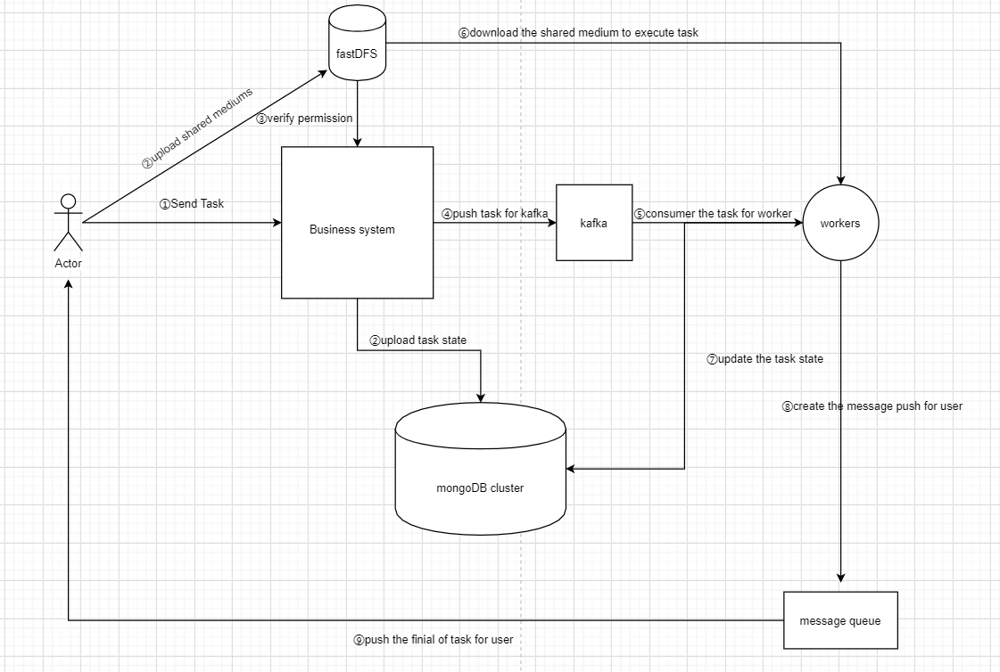

# Slow Walker

共享通用性工具代码，降低使用功能的要求，类似简单地SaaS模式，打造个人生产->全体使用的模式，提升业务效率，同时致力于打造出一款分布式功能共享系统，在局域网环境下一人创造，全员使用的模式。

## V1

+ RBAC管理，分为管理员，用户，审计员、技术员三种类型
    + 管理员(最高权限):①、能够查看分布式文件系统里面的所有文件 ②、能够创建和删除用户 ③、能够使用系统的功能 ④、能查看审计日志 ⑤、能修改用户的权限
    + 用户(普通权限): ①、仅能使用系统的功能
    + 审计员(审计权限):① 在能看到审计日志的同时能够对审计日志进行删除
    + 技术员: ①、能够看到审计日志 ②、能够增加系统中的功能 (待定)

+ 任务分发(核心):

    + 目前采取kafka作为任务分发的核心，同时采用fastdfs来作为分布式系统中的介质共享，业务系统授权给用户是否具有上传资格,适当解耦合避免业务系统因过多文件传输而负载过大。
    + worker节点根据自身特性(CPU、OSType)选择合适的task进行消费，并将最终执行结果上传到数据库并生成消息推送给用户
    + 采用延迟队列将task推送给kafka，避免因为共享介质未能正常上传而导致的任务执行失败

